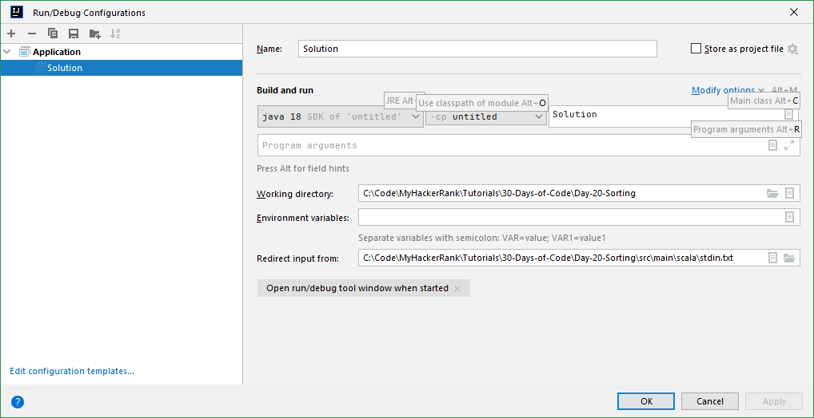

# MyHackerRank

My HackerRank

## [Scala] Quick fix to fit the local env

```scala
val printWriter = new PrintWriter(sys.env("OUTPUT_PATH"))
```

->

```scala
val printWriter = new PrintWriter(System.out)
```

## [Scale] Read from file

If the IDE is IJ, just changing the "Run/Debug config".



## [Scala] I use Array[mutable.Queue[Int]] to solve graph problems with Scala

```scala
import scala.collection.mutable

...

    val graph: Array[mutable.Queue[Int]] = Array.fill[mutable.Queue[Int]](n)(mutable.Queue[Int]())
    for (i <- astronaut.indices) {
      val x = astronaut(i)(0)
      val y = astronaut(i)(1)
      graph(x).enqueue(y)
      graph(y).enqueue(x)
    }

    val visited: Array[Boolean] = Array.fill[Boolean](n)(false)
```

## [Scala] Breaks, breakable, break

```scala
        val loop = new Breaks
        loop.breakable {
            for (i <- 0 to len / 2) {
                if (obj.popCharacter() != obj.dequeueCharacter()) {
                    isPalindrome = false
                    loop.break
                }
            }
        }
```

## [Scala] Stack

Annotations

@deprecated

Deprecated

(Since version 2.12.0) Stack is an inelegant and potentially poorly-performing wrapper around List. Use a List assigned to a var instead.

Scala program for implement stack using linked list.

mutable.Stack -> mutable.MutableList

```scala
var l = scala.collection.mutable.MutableList(1,2,3)
l += 4 
```

## [Scala] Queue

In Scala, Queue is implemented as a pair of lists. One is used to insert the elements and second to contain deleted elements. Elements are added to the first list and removed from the second list. The two most basic operations of Queue are Enqueue and Dequeue.

Enqueue – Adding an element at the end of the queue.

Dequeue – Deleting an element from the beginning of the queue.

## [Scala] LCM and GCD

```scala
  def gcd(a: Array[Int]): Int = {
    var n = a(0)
    for (i <- 1 until a.length) {
      n = gcd(n, a(i))
    }
    n
  }

  def gcd(a: Int, b: Int): Int = {
    var c = a
    var d = b
    while (d > 0) {
      var t = d
      d = c % d
      c = t
    }
    c
  }

  def lcm(a: Int, b: Int): Int = {
    a * (b / gcd(a, b))
  }

  def lcm(a: Array[Int]): Int = {
    var n = a(0)
    for (i <- 1 until a.length) {
      n = lcm(n, a(i))
    }
    n
  }
```

## [Java] List<Integer> to int[]

```java
int[] cookies = arr.stream().mapToInt(Integer::intValue).toArray();
```

## [Java] List<List<Integer>> to int[][]

```java
List<List<Integer>> list = new ArrayList<>();

int[][] arr = list.stream()
    .map(l -> l.stream().mapToInt(Integer::intValue).toArray())
    .toArray(int[][]::new);
```

## [Java] int[] to List<Integer>

List<Integer> list = Arrays.stream(ints).boxed().collect(Collectors.toList());

## [Java] String[] to int[]

```java
int[] ar = Stream.of(sr).mapToInt(Integer::parseInt).toArray();
```

## [Java] Read from file

```java
try (InputStream inputStream = new FileInputStream("stdin.txt");
        BufferedReader bufferedReader = new BufferedReader(new InputStreamReader(inputStream));) {
    
    int n = Integer.parseInt(bufferedReader.readLine());
    int[] ar = Stream.of(bufferedReader.readLine().split(" ")).mapToInt(Integer::parseInt).toArray();

  } catch (Exception ex) {
    System.out.println(ex.getMessage());
  }
}
```

## [Java] Array fill

```java
int frequency[] = new int[10001];
Arrays.fill(frequency, -1);
```

Scala only needs 1 line (also has the ofDim option).

## [Python] Quick fix to fit the local env

1. Create a local folder

2. Prepare stdin.txt

3. Grab the py code from HackerRank website (app.py)

4. Save a copy as app_fromfile.py

5. Change to `open('stdin.txt')` and replace all `input()` to `f.readline()`

Example:

```python
if __name__ == '__main__':
    with open('stdin.txt') as f:

        t = int(f.readline().strip())
```

## [Python] float['inf']

While performing mathematical operations ∞ is a very crucial concept.

float("inf") or float("INF") or float("Inf") or float("inF") or float("infinity") creates a float object holding infinity

float("-inf") or float("-INF") or float("-Inf") or float("-infinity") creates a float object holding negative infinity

float("NAN") or float("nan") or float("Nan") creates float holding not a number

## [Python] PE8 import

Refactor from

```python
from collections import *
from heapq import *
```

to soemthing like this -

```python
from collections import defaultdict
from heapq import heappop, heappush
```

## [Python] Tricky `f.readline().strip()`

stdin.txt

```bash
hackerhappy
hackerrank
9
```

```python
    with open('stdin.txt') as f:
        s = f.readline().strip()
```

With `.strip()` - 'hackerhappy'

Without `.strip()` - 'hackerhappy\n'

## Certification

### SQL (Basic) Skills Certification Test

%20Skills%20Certification.png)

### SQL (Intermediate) Skills Certification Test

%20Skills%20Certification.png)

### SQL (Advanced) Skills Certification Test

%20Skills%20Certification.png)
