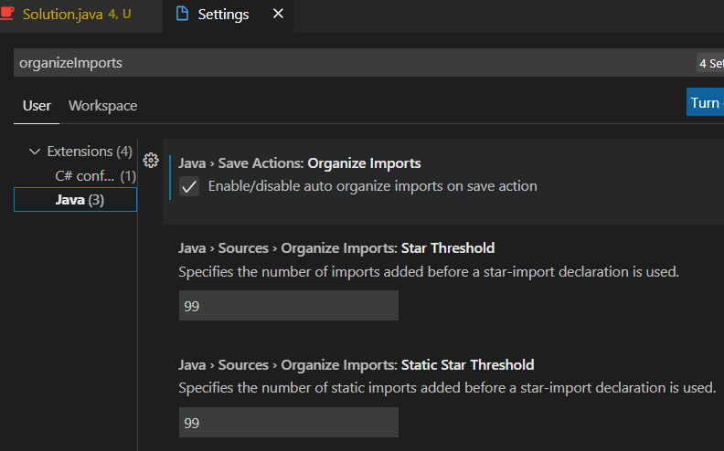

# MyHackerRank

My HackerRank

## [Scala] Quick fix to fit the local env

```scala
val printWriter = new PrintWriter(sys.env("OUTPUT_PATH"))
```

->

```scala
val printWriter = new PrintWriter(System.out)
```

## [Scale] Read from file

If the IDE is IJ, just changing the "Run/Debug config".


## [Scala] I use Array[mutable.Queue[Int]] to solve graph problems with Scala

```scala
import scala.collection.mutable

...

    val graph: Array[mutable.Queue[Int]] = Array.fill[mutable.Queue[Int]](n)(mutable.Queue[Int]())
    for (i <- astronaut.indices) {
      val x = astronaut(i)(0)
      val y = astronaut(i)(1)
      graph(x).enqueue(y)
      graph(y).enqueue(x)
    }

    val visited: Array[Boolean] = Array.fill[Boolean](n)(false)
```

## [Scala] Breaks, breakable, break

```scala
        val loop = new Breaks
        loop.breakable {
            for (i <- 0 to len / 2) {
                if (obj.popCharacter() != obj.dequeueCharacter()) {
                    isPalindrome = false
                    loop.break
                }
            }
        }
```

## [Scala] Stack

Annotations

@deprecated

Deprecated

(Since version 2.12.0) Stack is an inelegant and potentially poorly-performing wrapper around List. Use a List assigned to a var instead.

Scala program for implement stack using linked list.

mutable.Stack -> mutable.MutableList

```scala
var l = scala.collection.mutable.MutableList(1,2,3)
l += 4 
```

## [Scala] Queue

In Scala, Queue is implemented as a pair of lists. One is used to insert the elements and second to contain deleted elements. Elements are added to the first list and removed from the second list. The two most basic operations of Queue are Enqueue and Dequeue.

Enqueue – Adding an element at the end of the queue.

Dequeue – Deleting an element from the beginning of the queue.

## [Scala] LCM and GCD

```scala
  def gcd(a: Array[Int]): Int = {
    var n = a(0)
    for (i <- 1 until a.length) {
      n = gcd(n, a(i))
    }
    n
  }

  def gcd(a: Int, b: Int): Int = {
    var c = a
    var d = b
    while (d > 0) {
      var t = d
      d = c % d
      c = t
    }
    c
  }

  def lcm(a: Int, b: Int): Int = {
    a * (b / gcd(a, b))
  }

  def lcm(a: Array[Int]): Int = {
    var n = a(0)
    for (i <- 1 until a.length) {
      n = lcm(n, a(i))
    }
    n
  }
```

## [Java] List<Integer> to int[]

```java
int[] cookies = arr.stream().mapToInt(Integer::intValue).toArray();
```

## [Java] List<List<Integer>> to int[][]

```java
List<List<Integer>> list = new ArrayList<>();

int[][] arr = list.stream()
    .map(l -> l.stream().mapToInt(Integer::intValue).toArray())
    .toArray(int[][]::new);
```

## [Java] int[] to List<Integer>

List<Integer> list = Arrays.stream(ints).boxed().collect(Collectors.toList());

## [Java] String[] to int[]

```java
int[] ar = Stream.of(sr).mapToInt(Integer::parseInt).toArray();
```

## [Java] Read from file

```java
try (InputStream inputStream = new FileInputStream("stdin.txt");
        BufferedReader bufferedReader = new BufferedReader(new InputStreamReader(inputStream));) {
    
    int n = Integer.parseInt(bufferedReader.readLine());
    int[] ar = Stream.of(bufferedReader.readLine().split(" ")).mapToInt(Integer::parseInt).toArray();

  } catch (Exception ex) {
    System.out.println(ex.getMessage());
  }
}
```

## [Java] Array fill

```java
int frequency[] = new int[10001];
Arrays.fill(frequency, -1);
```

Scala only needs 1 line (also has the ofDim option).

## [Java] Collection vs Collections

In Java, Collection and Collections are not at all the same thing.

Collection is the interface where you group objects into a single unit.

Collections is a utility class that has some set of operations you perform on Collection. Collection does not have all static methods in it, but Collections consist of methods that are all static.

Some of the most common Collection interfaces:

- Set – The most important thing about Sets is that Sets should never contain any duplicate element or object. This Set Interface can be obtained from java. util package. Sets do not return their elements in their collection in any predictable order. It is unordered, and many Java developers often forget this fact and thus face bugs in their code.

EnumSet, HashSet, LinkedHashSet, TreeSet, ConcurrentSkipList Set etc are some classes which can be implemented on the Set interface.

- List – List implementation can be thought of as something similar to Python Lists, but they do have some differences. List interfaces in Java are collections of ordered elements or objects. They are sorted. Moreover, unlike Sets, Lists can allow duplicate elements in their collection. Like an Array, a List’s elements can be accessed based on its elements’ index or position. Some basic operations using Lists are – Searching for an element, Accessing an element from the list, etc.

Vector, Stack, LinkedList, ArrayList, CopyOnWriteArrayList are some of the most commonly used classes which can be used with List interfaces.

- Map – For those well acquainted with Python, Map Interface is very similar to the Dictionary data structure in Python Language. Using the Map interface, we can group and store data elements in key-value pairs. As evident from the fact, each key is unique in a Map, and hence there are no duplicate keys. Using the key, its corresponding value is returned.

HashMap, HashTable, EnumMap, TreeMap, IdentityHashMap, WeakHashMap are some classes that can be implemented with the Map interface.

- Stack – Most of the programmers are already familiar with Stacks and Queues (Queues discussed shortly). Stack interface is implemented based on the usual LIFO data structure, i.e., Last In First Out. In a Stack, elements are pushed into one end of the stack, and elements pop out from the same end of that stack.

- Queue – Queue interface, based on the usual Queue Data Structure, implements a FIFO method. FIFO stands for First In First Out. In simple words, elements are pushed in one end of the Queue and popped out from the other end of that Queue.

Some commonly used Collections class are:

- Collections.binarySearch() – Searches for the desired element in a collection using the popular Binary Search Algorithm.
- Collections.sort() – Performs sorting operation on the specified Collection.
- Collections.max() – As evident from the name, it returns the Maximum element from a specified Collection.
- Collections.min() – Returns the Minimum element from a specified Collection.
- Collections.reverse() – Reverses the order of the elements present in the specified Collection.
- Collections.copy() – As the name suggests, using this, elements from one collection are copied to another collection.

## [Java] Sort the `List<Integer>`

### Using Collections

Asc & Desc

```java
    public static void print(List<Integer> lst) {
        System.out.println(
                lst.stream()
                        .map(Object::toString)
                        .collect(Collectors.joining(" ")));
    }

    public static void main(String[] args) {
        List<Integer> lst = new ArrayList<>();

        lst.add(100);
        lst.add(-1);
        lst.add(10);
        lst.add(1);
        print(lst);
        
        Collections.sort(lst);
        print(lst);

        Collections.sort(lst, Collections.reverseOrder());
        print(lst);
    }
```

```bash
100 -1 10 1
-1 1 10 100
100 10 1 -1
```

### Using stream

Asc

```java
List<Integer> lst = arr.stream().sorted().collect(Collectors.toList()); // List<Integer> arr
```

Desc

```java
List<Integer> lst = calorie.stream().sorted(Comparator.reverseOrder()).collect(Collectors.toList()); // List<Integer> arr
```

## [Java] Visual Studio Code - auto organize imports



## [Java] print multiple variables

```java
System.out.printf("The Capital of Country %s is: %s", country, capital);
```

## [Java] 2D array, string sort etc

```java
    public static String gridChallenge(List<String> grid) {
        int row = grid.size();
        int col = grid.get(0).length();
        char[][] cgrid = new char[row][col];
        for (int i = 0; i < row; i++) {
            String s = grid.get(i);
            char[] cs = s.toCharArray();
            Arrays.sort(cs);
            cgrid[i] = cs;
        }

        for (int i = 0; i < col; i++) {
            for (int j = 0; j < row - 1; j++) {
                if (cgrid[j + 1][i] < cgrid[j][i]) {
                    return "NO";
                }
            }
        }

        return "YES";
    }
```

## [Python] Quick fix to fit the local env

1. Create a local folder

2. Prepare stdin.txt

3. Grab the py code from HackerRank website (app.py)

4. Save a copy as app_fromfile.py

5. Change to `open('stdin.txt')` and replace all `input()` to `f.readline()`

Example:

```python
if __name__ == '__main__':
    with open('stdin.txt') as f:

        t = int(f.readline().strip())
```

## [Python] float['inf']

While performing mathematical operations ∞ is a very crucial concept.

float("inf") or float("INF") or float("Inf") or float("inF") or float("infinity") creates a float object holding infinity

float("-inf") or float("-INF") or float("-Inf") or float("-infinity") creates a float object holding negative infinity

float("NAN") or float("nan") or float("Nan") creates float holding not a number

## [Python] PE8 import

Refactor from

```python
from collections import *
from heapq import *
```

to soemthing like this -

```python
from collections import defaultdict
from heapq import heappop, heappush
```

## [Python] Tricky `f.readline().strip()`

stdin.txt

```bash
hackerhappy
hackerrank
9
```

```python
    with open('stdin.txt') as f:
        s = f.readline().strip()
```

With `.strip()` - 'hackerhappy'

Without `.strip()` - 'hackerhappy\n'

## Certification

### SQL (Basic) Skills Certification Test

%20Skills%20Certification.png)

### SQL (Intermediate) Skills Certification Test

%20Skills%20Certification.png)

### SQL (Advanced) Skills Certification Test

%20Skills%20Certification.png)
