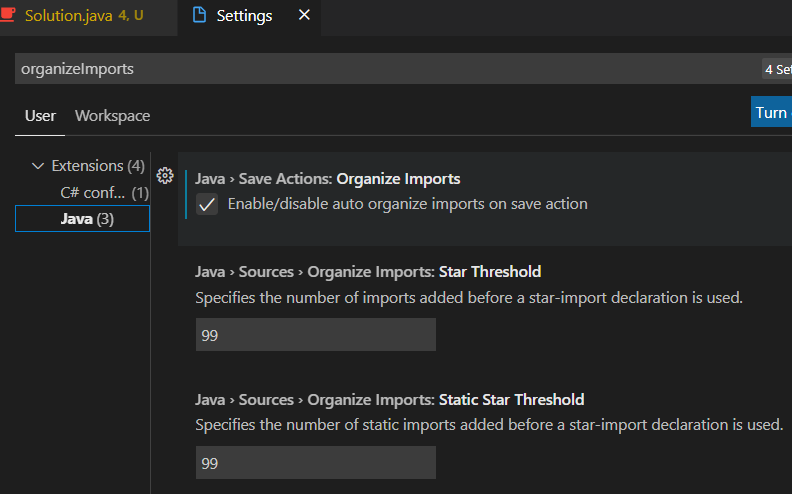

# MyHackerRank with Java

My HackerRank with Java

## [Java] List<Integer> to int[]

```java
int[] cookies = arr.stream().mapToInt(Integer::intValue).toArray();
```

## [Java] List<List<Integer>> to int[][]

```java
List<List<Integer>> list = new ArrayList<>();

int[][] arr = list.stream()
    .map(l -> l.stream().mapToInt(Integer::intValue).toArray())
    .toArray(int[][]::new);
```

## [Java] int[] to List<Integer>

List<Integer> list = Arrays.stream(ints).boxed().collect(Collectors.toList());

## [Java] String[] to int[]

```java
int[] ar = Stream.of(sr).mapToInt(Integer::parseInt).toArray();
```

## [Java] Read from file

```java
try (InputStream inputStream = new FileInputStream("stdin.txt");
        BufferedReader bufferedReader = new BufferedReader(new InputStreamReader(inputStream));) {
    
    int n = Integer.parseInt(bufferedReader.readLine());
    int[] ar = Stream.of(bufferedReader.readLine().split(" ")).mapToInt(Integer::parseInt).toArray();

  } catch (Exception ex) {
    System.out.println(ex.getMessage());
  }
}
```

## [Java] Array fill

```java
int frequency[] = new int[10001];
Arrays.fill(frequency, -1);
```

Scala only needs 1 line (also has the ofDim option).

## [Java] Collection vs Collections

In Java, Collection and Collections are not at all the same thing.

Collection is the interface where you group objects into a single unit.

Collections is a utility class that has some set of operations you perform on Collection. Collection does not have all static methods in it, but Collections consist of methods that are all static.

Some of the most common Collection interfaces:

- Set – The most important thing about Sets is that Sets should never contain any duplicate element or object. This Set Interface can be obtained from java. util package. Sets do not return their elements in their collection in any predictable order. It is unordered, and many Java developers often forget this fact and thus face bugs in their code.

EnumSet, HashSet, LinkedHashSet, TreeSet, ConcurrentSkipList Set etc are some classes which can be implemented on the Set interface.

- List – List implementation can be thought of as something similar to Python Lists, but they do have some differences. List interfaces in Java are collections of ordered elements or objects. They are sorted. Moreover, unlike Sets, Lists can allow duplicate elements in their collection. Like an Array, a List’s elements can be accessed based on its elements’ index or position. Some basic operations using Lists are – Searching for an element, Accessing an element from the list, etc.

Vector, Stack, LinkedList, ArrayList, CopyOnWriteArrayList are some of the most commonly used classes which can be used with List interfaces.

- Map – For those well acquainted with Python, Map Interface is very similar to the Dictionary data structure in Python Language. Using the Map interface, we can group and store data elements in key-value pairs. As evident from the fact, each key is unique in a Map, and hence there are no duplicate keys. Using the key, its corresponding value is returned.

HashMap, HashTable, EnumMap, TreeMap, IdentityHashMap, WeakHashMap are some classes that can be implemented with the Map interface.

- Stack – Most of the programmers are already familiar with Stacks and Queues (Queues discussed shortly). Stack interface is implemented based on the usual LIFO data structure, i.e., Last In First Out. In a Stack, elements are pushed into one end of the stack, and elements pop out from the same end of that stack.

- Queue – Queue interface, based on the usual Queue Data Structure, implements a FIFO method. FIFO stands for First In First Out. In simple words, elements are pushed in one end of the Queue and popped out from the other end of that Queue.

Some commonly used Collections class are:

- Collections.binarySearch() – Searches for the desired element in a collection using the popular Binary Search Algorithm.
- Collections.sort() – Performs sorting operation on the specified Collection.
- Collections.max() – As evident from the name, it returns the Maximum element from a specified Collection.
- Collections.min() – Returns the Minimum element from a specified Collection.
- Collections.reverse() – Reverses the order of the elements present in the specified Collection.
- Collections.copy() – As the name suggests, using this, elements from one collection are copied to another collection.

## [Java] Sort the `List<Integer>`

### Using Collections

Asc & Desc

```java
    public static void print(List<Integer> lst) {
        System.out.println(
                lst.stream()
                        .map(Object::toString)
                        .collect(Collectors.joining(" ")));
    }

    public static void main(String[] args) {
        List<Integer> lst = new ArrayList<>();

        lst.add(100);
        lst.add(-1);
        lst.add(10);
        lst.add(1);
        print(lst);
        
        Collections.sort(lst);
        print(lst);

        Collections.sort(lst, Collections.reverseOrder());
        print(lst);
    }
```

```bash
100 -1 10 1
-1 1 10 100
100 10 1 -1
```

### Using stream

Asc

```java
List<Integer> lst = arr.stream().sorted().collect(Collectors.toList()); // List<Integer> arr
```

Desc

```java
List<Integer> lst = calorie.stream().sorted(Comparator.reverseOrder()).collect(Collectors.toList()); // List<Integer> arr
```

## [Java] Visual Studio Code - auto organize imports



## [Java] print multiple variables

```java
System.out.printf("The Capital of Country %s is: %s", country, capital);
```

## [Java] 2D array, string sort etc

```java
    public static String gridChallenge(List<String> grid) {
        int row = grid.size();
        int col = grid.get(0).length();
        char[][] cgrid = new char[row][col];
        for (int i = 0; i < row; i++) {
            String s = grid.get(i);
            char[] cs = s.toCharArray();
            Arrays.sort(cs);
            cgrid[i] = cs;
        }

        for (int i = 0; i < col; i++) {
            for (int j = 0; j < row - 1; j++) {
                if (cgrid[j + 1][i] < cgrid[j][i]) {
                    return "NO";
                }
            }
        }

        return "YES";
    }
```

## [Java] Reverse a string

```java
    public static String reverseString(String s) {
        StringBuilder sb = new StringBuilder(s);
        return sb.reverse().toString();
    }
```

## [Java] Initialize an int array

```java
    int[] intArray = new int[5];
    intArray[0] = 3;
    intArray[1] = 12;
    intArray[2] = 45;
    intArray[3] = 23;
    intArray[4] = 11;
```

## [Java] Initialize an int List

```java
    // For ArrayList
    List<Integer> list = new ArrayList<Integer>();
    list.add(1);
    list.add(3);

    // For LinkedList
    List<Integer> llist = new LinkedList<Integer>();
    llist.add(2);
    llist.add(4);

    // For Stack
    List<Integer> stack = new Stack<Integer>();
    stack.add(3);
    stack.add(1);
```

## [Java] Initialize a Queue

```java
    Queue<String> pq = new PriorityQueue<>();

    pq.add("Geeks");
    pq.add("For");
    pq.add("Geeks");
```

## [Java] Basic usage of PriorityQueue

```java
    Queue<Integer> pQueue = new PriorityQueue<Integer>();

    // Adding items to the pQueue
    // using add()
    pQueue.add(10);
    pQueue.add(20);
    pQueue.add(15);

    // Printing the top element of
    // the PriorityQueue
    System.out.println(pQueue.peek()); // 10

    // Printing the top element and removing it
    // from the PriorityQueue container
    System.out.println(pQueue.poll()); // 10

    // Printing the top element again
    System.out.println(pQueue.peek()); // 15
```

## [Java] Array sort and BinarySearch

```java
    int intArr[] = { 10, 20, 15, 22, 35 };
    
    // Using sort() method of Arrays class
    // and passing arrays to be sorted as in arguments
    Arrays.sort(intArr);
    
    int intKey = 22;
    
    // Now in sorted array we will fetch and
    // return elements/indiciesaccessing indexes to show
    // array is really sorted

    System.out.println(intKey + " found at index = " + Arrays.binarySearch(intArr, intKey));
```

## [Java] Copy an Array to a new Array

System.arraycopy

```java
    int[] arrOld1 = {23, 43, 55};
    int[] arrCopied1 = new int[arrOld1.length];
    System.arraycopy(arrOld1, 0, arrCopied1, 0, 3);
```

Arrays.copyOf

```java
    String[] arrOld3 = {"Brian", "Effie", "Emily", "Jessie"};
    String[] arrCopied3 = Arrays.copyOf(arrOld3, arrOld3.length);
```

Object.clone

```java
    Employee[] employees = new Employee[3];
    employees[0] = new Employee("Brian", "M");
    employees[1] = new Employee("Effie", "F");
    employees[2] = new Employee("Emily", "F");
    Employee[] copiedEmployees = employees.clone();
```

Arrays.stream

```java
    String[] strArray = {"orange", "red", "green'"};
    String[] copiedArray = Arrays.stream(strArray).toArray(String[]::new);
```

Deep copy for primitive object types.

Shallow copy for non-primitive object types.

## [Java] Print an array

```java
    String[] arr = {"Brian", "is", "awesome"};
    System.out.println(Arrays.toString(arr));
```

## [Java] Print a 2D array

```java
    double[][] arr = {{1, 5}, {13, 1.55}, {12, 100.6}, {12.1, .85}};
    System.out.printf("Before sort, %s\n", Arrays.deepToString(arr));
```

## [Java] Sort a 2D array

```java
    double[][] arr = {{1, 5}, {13, 1.55}, {12, 100.6}, {12.1, .85}};
    System.out.printf("Before sort, %s\n", Arrays.deepToString(arr));

    Arrays.sort(arr, (a, b) -> Double.compare(a[0], b[0]));
    System.out.printf("After sort, %s\n", Arrays.deepToString(arr));


    int[][] pts3 = {{-1, 3}, {1, 2}, {-2, 2}, {0, -1}, {-2, 1}};
    System.out.printf("Before sort, %s\n", Arrays.deepToString(pts3));

    Arrays.sort(pts3, (a, b) -> {
        if (a[0] == b[0]) {
            return (a[1] < b[1]) ? -1 : 1;
        }
        return (a[0] < b[0]) ? -1 : 1;
    });
    System.out.printf("After sort, %s\n", Arrays.deepToString(pts3));
```
